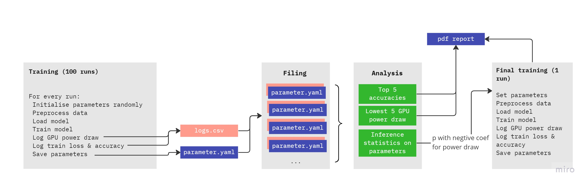

# Hyperparameter Optimization for computationally efficient Deep Learning Training

We built a streamlined training pipeline to objectively test the energy consumption of training a ResNet-50 model on image classification in different scenarios. We selected three preprocessing techniques and seven model / hyperparameter optimization approaches that are either switched on or off during training. As part of the project, we built an open-source package that allows users to import `SMICallback()` (of type `tf.keras.callbacks.Callback`) which logs GPU power draw, next to training loss, and accuracy in csv files for `tf.keras.Sequential` models. 

The paper report with detailed result descriptions of this project can be found here:

LINK TO PAPER REPORT

A from this research resulting python package (currently work in progress) that tracks the training efficiency of models using the `SMICallback()` can be downloaded here: 

https://pypi.org/project/greenscreen/ [`pip install greenscreen`]

## project and file structure

The following figure displays the structure of our pipeline. It is inspired by the automated hyperparameter tuning of [Weights & Biases](https://docs.wandb.ai/guides/sweeps):



### parameter configuration
We selected a number of techniques and parameters for this project and stored them in `config.yaml`. The following is a print of the same in dictionary format showing all keys and respective values:

```
{
'preprocessing':      array(['None', 'standardization', 'robust_scaling', 'minmax'], dtype='<U32'),
'augmentation':       array(['None', 'random', 'mixup', 'cutmix'], dtype='<U32'),
'precision':          array(['float16', 'float32', 'float64', 'global_policy_float16'], dtype='<U32'),
'batch_size':         array(['4', '32', '64', '128'], dtype='<U32'),
'partitioning':       array(['60-20-20', '70-15-15', '80-10-10', '90-5-5'], dtype='<U32'),
'lr':                 array(['0.01', '0.00015', '0.0008', '0.00625'], dtype='<U32'),
'lr_schedule':        array(['constant', 'exponential', 'polynomial', 'cosine'], dtype='<U32'),
'optimizer_momentum': array(['0.0', '0.5', '0.9', '0.99'], dtype='<U32'),
'optimizer':          array(['RMSProp', 'SGD', 'Adam', 'AdamW'], dtype='<U32'),
'internal':           array(['None', 'pre_quantization', 'post_quantization', 'jit_compilation'], dtype='<U32')
}
```
<br />

For the project, we chose `n=100` as the number of runs to train and track the model. `greenscreen.sh` kicks off the pipeline by first calling `main.py`. For each run, `main.py` calls `config_creator.py` to generate a random combination of parameters for one run. Based on the techniques / parameters switched on, `main.py` runs through preprocessing, model building, model compiling, and model training.

### training logs
`model.fit` is called with `SMICallback()`as callback function:

```
combined_model.fit(
    train_ds,
    validation_data=val_ds,
    epochs=args.epochs,
    callbacks=[SMICallback()],
)
```

This callback function starts GPU tracking upon the first epoch of training and logs GPU power draw in watt for each epoch until the last epoch with the following command:

```
subprocess.check_output(['nvidia-smi', '--query-gpu=power.draw,temperature.gpu,utilization.gpu', '--format=csv,noheader'])
```

<br />

The logs are sent to `logs.csv` which is an individual log file for the respective run. It is sent to an individual run folder where, the parameters of the very same run are saved in `parameters.yaml`. This folder is accessed later during the result analysis. `logs.csv` also contains training and validation accuracy next to some other data.

### result analysis
Next, `analysis.py` is called to compare all runs and extract the top runs in terms of accuracies, lowest GPU power draw, and overall efficiency (accuracy / GPU power draw). It also runs inference statistics to check for the influence / relevance of each parameter for the GPU power draw. After comparing all results, `analysis.py` hands over to `main.py` the parameter value of each parameter that is most relevant for a low GPU power draw. With this, `greenscreen.sh` calls `main.py` for a final training of 50 epochs.

### pdf report
`pdf_creation.py` can be called to produce a pdf report of the results for a clear visualisation. The report includes tables with the top runs in terms of accuracies, lowest GPU power draw, and overall efficiency (accuracy / GPU power draw) as well as plots visualising loss, accuracy, and GPU power draw during training of the most efficient run as well as the respective parameters that were switched on.
