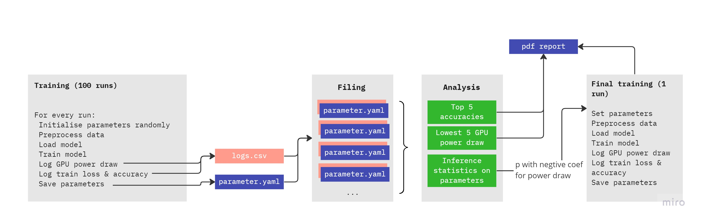

# project: green_screen

We built a streamlined training pipeline to objectively test the energy consumption of training a ResNet-50 model on image classification in different scenarios. We selected three preprocessing techniques and seven model / hyperparameter optimization approaches that are either switched on or off during training. The following figure displays the structure of our pipeline:



## project and file structure

The selected techniques and parameters are stored in `config.yaml`. The following is a print of the same in dictionary format showing all keys and respective values:

```
{
'preprocessing':      array(['None', 'standardization', 'robust_scaling', 'minmax'], dtype='<U32'),
'augmentation':       array(['None', 'random', 'mixup', 'cutmix'], dtype='<U32'),
'precision':          array(['float16', 'float32', 'float64', 'global_policy_float16'], dtype='<U32'),
'batch_size':         array(['4', '32', '64', '128'], dtype='<U32'),
'partitioning':       array(['60-20-20', '70-15-15', '80-10-10', '90-5-5'], dtype='<U32'),
'lr':                 array(['0.01', '0.00015', '0.0008', '0.00625'], dtype='<U32'),
'lr_schedule':        array(['constant', 'exponential', 'polynomial', 'cosine'], dtype='<U32'),
'optimizer_momentum': array(['0.0', '0.5', '0.9', '0.99'], dtype='<U32'),
'optimizer':          array(['RMSProp', 'SGD', 'Adam', 'AdamW'], dtype='<U32'),
'internal':           array(['None', 'pre_quantization', 'post_quantization', 'jit_compilation'], dtype='<U32')
}
```

<br >
For the project, we chose `n=100` for the number of runs to train and track the model. For each run, `main.py` calls `config_creator.py` to generate a random combination of parameters for one run. Based on the techniques / parameters switched on, `main.py` runs through preprocessing, model building, model compiling, and model training.

<br >
Finally, `model.fit` is called with `SMICallback()`as callback function:

```
combined_model.fit(
    train_ds,
    validation_data=val_ds,
    epochs=args.epochs,
    callbacks=[SMICallback()],
)
```

This callback function starts GPU tracking upon the first epoch of training and logs GPU power draw in watt for each epoch until the last epoch with the following command:

```
subprocess.check_output(['nvidia-smi', '--query-gpu=power.draw,temperature.gpu,utilization.gpu', '--format=csv,noheader'])
```

The logs are sent to `logs.csv` which is an individual log file for the respective run. It is sent to an individual run folder where, next to the logs the parameters of the very same run are saved in `parameters.yaml`. This folder is accessed later when `main.py` calls `analysis.py` to analyse the results. The `logs.csv` file contains training and validation accuracy as well as the GPU workload.


## Credits


Known bugs:
- global policy float 16 does not work with experimental optimizers (AdamW), maybe works in tf 2.10
- tf optimizer AdamW is not compatible with tf METAL (for MacOS) !! Say this in the report in case they use MacOS. (Does not work with tf-macos 2.9.2, tf-metal 0.5.0)
->> Changed to AdamW from tfa instead of experimental AdamW from tf (seems to be working now), dont know about Macos

- I will remove all the decay params for AdamW. Explain in the report that while this is extremely important for large models, it just doesnt make sense to include in a parameter search that only gets activate when AdamW is chose // and or when using smaller models.
- I will remove post quantization methods. Explain in the paper that the future of green computing probably lies on quantization, but it is in such an early and non-compatible stage that it was not usable in this project, but a very important part for future green energy tranining bla bla.

- Global policy float 16 is not compatible with pre-quantization, so if global policy float 16 is chosen, pre-quantization will be deactivated. (This is not a bug, but a feature, wow)

- jit-compilation does not work on MacOS, METAL (maybe on other systems too).


!!! UTILS NEEDED !!!:
- Util function that creates subfolders per training run "n" in main
- . that logs all paramters configs from main into a separate yaml file in the subfolder run folder (to_yaml(args, path))
- (. that converts the information of the run-config into a PDF via the "borb" package, or imshow (heatmap) plot of the config)
- . that logs all paramters configs + OTHERS (see main.py end) to a csv file in root directory that updates after every run (to_csv(args))
- . that after n runs completes, finds the best configuration via this csv
- . that creates a model with these parameters after all n runs
- . ...


OLD TODO's: 
* Extend custom callback to use nvidia-ml-py3 instead of nvidia-smi in shell. This way the power usage is linked directly to the training and can be exported to the csv file directly (better automation). 
  * Use nvidia-ml-py3 or the wrapper py3nvml (https://py3nvml.readthedocs.io/en/latest/)
  * Information on metrics (like GPU usage, etc.) on https://lambdalabs.com/blog/weights-and-bias-gpu-cpu-utilization
      * This is the same metric that WANDB uses to track training runs


